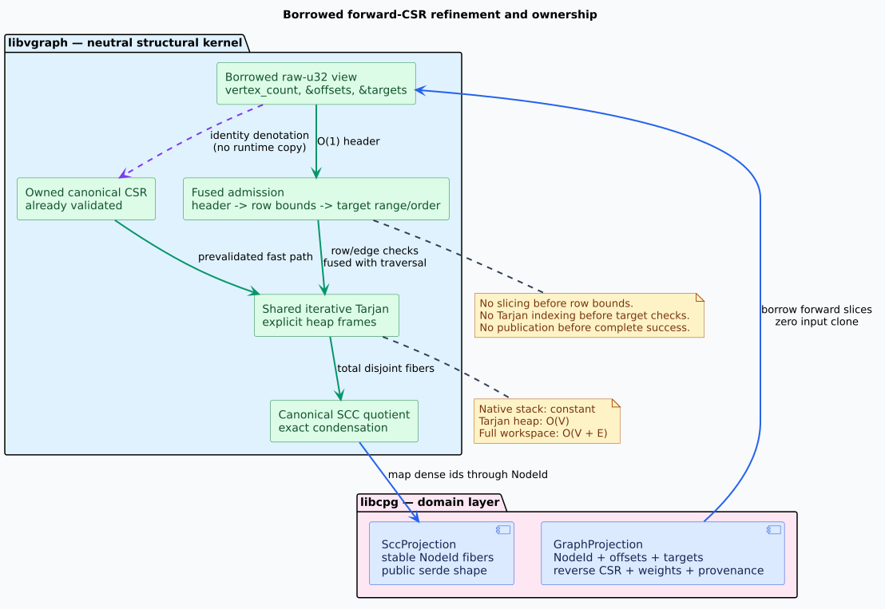

# Borrowed CSR Refinement Contract

## Purpose and boundary

Compressed sparse row (CSR) is a representation of a directed graph in two
contiguous arrays. An *offset* pair delimits one vertex's successor row, and a
*target* is the dense identifier stored at an edge position. A *borrowed CSR
observation* reads caller-owned offset and target slices without copying,
sorting, transposing, or retaining them.

This contract permits libcpg to lend the forward adjacency already stored by
its `GraphProjection` to libvgraph. libvgraph remains the neutral structural
kernel; libcpg remains responsible for code-property-graph semantics, stable
`NodeId` values, provenance, public serialization, and compatibility.



The dependency and semantic direction is one-way:

```text
libcpg GraphProjection
  -> borrowed raw-u32 forward CSR
  -> libvgraph SCC quotient
  -> libcpg NodeId/provenance/serde result
```

libvgraph does not depend on libcpg, lling-llang, reverse-CSR data,
application weights, or serialization.

## Mathematical semantics

Let `V` be the number of dense vertices, `E` the number of forward edges,
`O` the offset sequence, and `T` the target sequence. An admitted observation
satisfies:

```math
\lvert O\rvert = V + 1,\qquad O_0 = 0,\qquad O_V = E = \lvert T\rvert .
```

For every dense vertex `v`, its row is the half-open interval
$`[O_v,O_{v+1})`$. Admission requires:

```math
0 \le O_v \le O_{v+1} \le E.
```

For every edge position `p` in that interval:

```math
0 \le T_p < V.
```

Targets within a row are strictly increasing:

```math
O_v \le p < p+1 < O_{v+1}
\Longrightarrow T_p < T_{p+1}.
```

Strict ordering simultaneously establishes canonical ordering and excludes
duplicate edges. It is intentionally checked rather than normalized: borrowed
input must already be canonical. Permutation and duplicate invariance apply to
the owned constructor that canonicalizes arbitrary edge enumerations before
they are borrowed.

The edge relation denoted by either storage mode is:

```math
v \to w
\Longleftrightarrow
\exists p.\; O_v \le p < O_{v+1} \land T_p = w.
```

Consequently, materializing an admitted borrowed observation as owned CSR is
an identity refinement of the graph relation. The strongly connected
component (SCC) quotient therefore commutes with the storage change: both
routes produce the same mutual-reachability fibers and the same exact
condensation graph.

## Fused admission state machine

The validation order is part of the safety contract, not an implementation
detail. The implementation must refine the following literate pseudocode:

```text
ADMIT-AND-DECOMPOSE(vertex_count, offsets, targets)
  Check the constant-size header:
    offset length, zero origin, terminal equals target length.

  For every newly discovered vertex:
    Read its adjacent offset pair.
    Check start <= stop <= target length.
    Store start, stop, cursor, and previous target in an explicit DFS frame.

  While that frame has an edge:
    Read the target at cursor only after cursor < stop <= target length.
    Check target < vertex_count before indexing Tarjan arrays.
    Check previous < target unless this is the first target in the row.
    Perform the existing iterative Tarjan transition.

  After every vertex and edge has been checked:
    Materialize canonical fibers and the exact condensation.
    Publish one complete result.

  On malformed input, cancellation, or resource exhaustion:
    Return an error and publish no result.
```

An owned `CsrGraph` has already discharged these obligations during
construction and must retain its unchecked internal fast path. A crate-private
sealed adjacency accessor may share one Tarjan state machine between owned and
borrowed inputs. A broad public trait is deliberately excluded until several
independent consumers demonstrate a common safe contract.

## Category-theoretic interpretation

The storage change is a representation refinement, not a change of graph
object. The identity-on-vertices-and-edges map is a directed-graph
isomorphism. SCC decomposition is the quotient by mutual reachability; each
component is a fiber of the quotient map. Exact condensation is induced by
cross-fiber source edges. The identity-denotation path through borrowed input
and the already-validated owned path therefore commute with the shared SCC
quotient. The ownership and refinement diagram above shows both paths entering
the same iterative Tarjan state machine and producing one canonical quotient.

This formulation explains why libcpg may translate dense fibers back to
stable `NodeId` values without moving CPG semantics into libvgraph.

## Complexity and storage

Fused validation performs one header event, one row event per vertex, and one
target event per edge:

```math
W_{\mathrm{validation}}(V,E)=1+V+E.
```

The conservative combined Tarjan-plus-validation operation bound is:

```math
W_{\mathrm{borrowed}}(V,E)=6V+2E+1.
```

This is strict linear work and does not represent a second edge traversal:
range and ordering predicates execute inside the existing edge-inspection
transition.

Tarjan retains $`O(V)`$ auxiliary heap storage and constant native-stack
depth. Exact quotient canonicalization retains the released pipeline's
$`O(V+E)`$ reusable workspace:

```math
S_{\mathrm{pipeline}}(V,E)\le 9V+2E+2{,}048.
```

The borrowed adapter contributes exactly zero input-clone slots. Returned
fibers and condensation storage are excluded from the reusable-workspace
bound.

## Verification evidence and negative controls

The machine-readable
[`borrowed-csr.json`](../../formal/invariants/borrowed-csr.json) ledger maps
each invariant to its proof, model, negative control, exhaustive oracle, and
future implementation property.

- `formal/rocq/BorrowedCsrRefinement.v` proves the representation, admission,
  SCC-fiber, quotient, singleton-cycle, work, and storage theorems. Every
  acceptance theorem is audited with `Print Assumptions`.
- `formal/tla/BorrowedCsrMachine.tla` checks validation-before-indexing,
  fail-atomic publication, cancellation, coverage, and exact work.
- Six TLA+ required-red configurations remove header, offset, target, order,
  duplicate, or publication checks and must produce counterexamples.
- `formal/z3/BorrowedCsrRefinement.smt2` proves the arithmetic and relational
  obligations unsatisfiable under their negations. Its required-red companion
  exhibits six satisfiable counterexamples.
- `formal/model/exhaustive_graphs.rs` checks all 66,067 directed graphs through
  four vertices, 48,776 bounded raw representations, every cancellation point
  through three vertices, and a 20,000-vertex chain on a 256 KiB native stack.

The formal artifacts precede all production Rust changes.

## Scientific basis

The SCC kernel refines Tarjan's depth-first-search algorithm while representing
the call stack explicitly on the heap. See Robert Tarjan, “Depth-First Search
and Linear Graph Algorithms,” *SIAM Journal on Computing* 1(2), 1972,
<https://doi.org/10.1137/0201010>.
