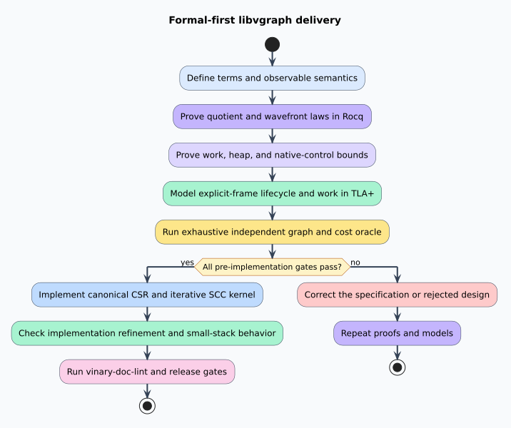

# Formal-First Architecture Contract

## Purpose

This document fixes the boundary between verified semantics and implementation choices.
A **formal contract** is a machine-checked mathematical or state-transition specification. A
**refinement** is evidence that a concrete implementation preserves the observations of that
contract.

## Verification layers

| Layer | Artifact | Obligation |
|---|---|---|
| Relational and resource semantics | `formal/rocq/GraphQuotient.v` | Fibers, quotient edges, acyclicity, renaming, enumeration, wavefront laws, exact logical work, linear heap space, and constant native control depth |
| Witness relational semantics | `formal/rocq/GraphWitnesses.v` | Opaque sidecar union, edge-index replay, reachability, quotient witness fibers, dominance/frontiers, naturality qualification, outcomes, and resource bounds |
| Lifecycle model | `formal/tla/IterativeGraphMachine.tla` | Explicit frames, bounded frame count, exact discovery/edge/frame accounting, linear work, completion, and cancellation |
| Witness lifecycle model | `formal/tla/WitnessMachine.tla` | Canonical search, parent reconstruction, replay, budgets, cancellation, exact/unreachable/invalid separation, and heap/work bounds |
| Exhaustive oracle | `formal/model/exhaustive_graphs.rs` | Canonical forward/reverse CSR, every graph through four vertices, independent SCC oracle, all renamings, induced condensation/rank/flat-wave equivalence, adversarial enumerations, exact work and returned-buffer counters, and a small-stack deep graph |
| Witness exhaustive oracle | `formal/model/exhaustive_witnesses.rs` | Every graph through three vertices, every root and renaming, independent dominance/frontier definitions, provenance laws, selector counterexample, mutants, malformed inputs, and a deep small-stack chain |
| Arithmetic refinement | `formal/verus/flat_wave_refinement.rs` | Rank-fiber partition laws, flat storage, exact schedule work, integer-domain safety, and the phase-complete uniform bound |
| Witness arithmetic refinement | `formal/verus/witness_refinement.rs` | Flat sidecar/path storage, union/search/dominator/frontier charges, integer-domain safety, and explicit-heap control |
| Production refinement | Rust tests and Kani harnesses | CSR validation, iterative Tarjan parity, stable ordering, malformed-input behavior, concrete overflow and fail-atomic checks, measured work/allocation bounds, recursion census, and small-stack lifecycle |
| Dependency boundary | `scripts/check-core-boundary.sh` | Kernel metadata and sources contain no serialization dependency, feature, codec, schema, hash, or provenance implementation |

The first three layers preceded production implementation. Verus and Kani connect the general
resource contract and concrete Rust operations during refinement. Every layer is required for the
complete gate.

## Public boundary reserved by the contract

The formal work reserves behaviors rather than premature Rust signatures:

- canonical construction from stable vertices and directed edges;
- non-panicking validation of public or imported CSR;
- deterministic forward and reverse adjacency;
- strict-linear iterative SCC decomposition and explicit component lookup;
- exact condensation construction and deterministic topological wavefronts;
- replayable edge-index paths and complete condensation source-edge witness fibers;
- rooted immediate dominators and dominance frontiers with unreachable state preserved;
- provenance sidecars at the separately versioned `libvgraph-interop` boundary; and
- structured incomplete or invalid outcomes when a resource or representation bound is exceeded.

Fixed-point solving, CPG semantics, parser semantics, equality saturation, and weighted algebra are
outside this crate until two consumers demonstrate one identical, independently specified
contract.

## Refinement checklist

An implementation release is admitted only when all answers are “yes.”

1. Does construction preserve the extensional edge relation after sorting and duplicate removal?
2. Does validation reject every malformed offset, endpoint, reverse-edge, and stable-node order?
3. Does SCC output equal independent mutual-reachability classes?
4. Does the quotient contain exactly the witnessed cross-component edges?
5. Is the condensation acyclic and every reported wavefront dependency-valid?
6. Are results invariant under edge enumeration and equivariant under stable-ID renaming?
7. Do 20,000 semantic vertices and 100,000 lifecycle operations fit a 256 KiB native stack where
   the public operation applies?
8. Are caps, cancellation, malformed input, and overflow explicit rather than reported as success?
9. Do serial and future parallel paths produce the same canonical output?
10. Do the core-boundary check, Rocq, TLC, the exhaustive oracle, Verus, Kani, Rust tests, strict
    lint, and documentation lint all pass inside their resource scopes?
11. On canonical CSR, does SCC work equal $`5|V| + |E|`$ logical events and stay within
    $`5|V| + |C| \le 6|V|`$ auxiliary logical entries, excluding returned output?
12. Does phase-complete charging include safe workspace initialization, flat fiber
    materialization, paired condensation CSR construction, flat wave offsets and members, and
    exact radix work, with a bound at or below $`27|V| + 20|E| + 26{,}628`$?
13. Does reusable temporary storage stay at or below $`9|V| + 2|E| + 2{,}048`$ slots,
    excluding returned partition, condensation, and schedule values?
14. Does a source and call-graph census establish zero recursive control edges on every public
    input-depth-sensitive path?
15. Do path witnesses reject every invalid edge/routing step and replay exactly to their stated
    endpoints?
16. Do complete quotient-edge witness fibers and provenance unions commute with lawful renaming?
17. Is every exact single-choice equivariance claim qualified by an explicitly transported strict
    total order?
18. Do immediate dominators and dominance frontiers equal independent definition-level oracles
    for every bounded rooted graph?
19. Do witness search, replay, link-eval compression, dominator-tree traversal, and frontier
    materialization pass the 20,000-vertex 256 KiB native-stack gate?

The symbols $`V`$ and $`E`$ denote source vertices and canonical source edges. The symbol $`R`$
denotes cross-component candidates before quotient deduplication. The symbols $`C`$, $`Q`$, and
$`W`$ denote SCC components, distinct condensation edges, and nonempty dependency waves.
Returned graph, partition, condensation, and schedule storage is output; temporary arrays, queues,
stacks, and sorting buffers are auxiliary storage.
