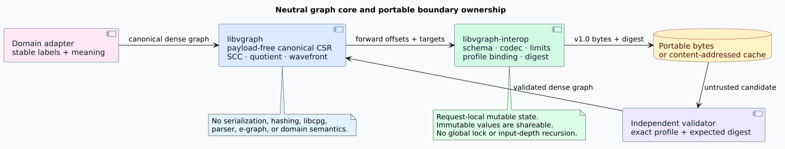
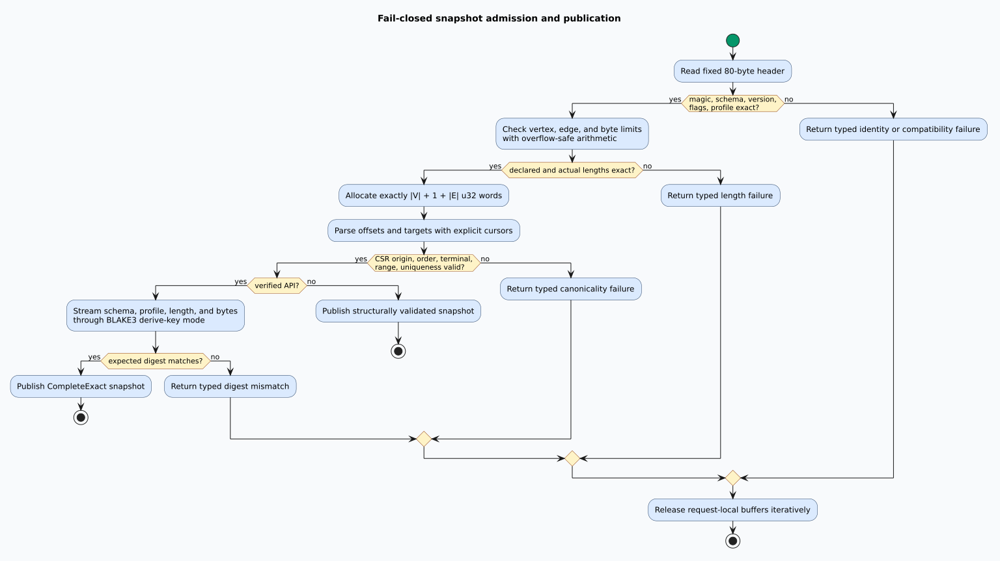

# Portable snapshot boundary

This document fixes the ownership and trust boundary for canonical graph snapshots. The formal
contract is complete on branch `feature/vco-e2-interop-formal`; the separately packaged
`libvgraph-interop` implementation must refine it without adding serialization or hashing
to the `libvgraph` kernel.

## Terms

A **canonical compressed sparse row graph** (canonical CSR graph) stores every dense vertex in
ascending numeric order, every adjacency row in strictly ascending target order, and no duplicate
edge. A **snapshot** is the exact byte representation of one canonical forward CSR graph. A
**semantic profile identity** is an opaque 32-byte caller-owned value that names the interpretation
under which a snapshot may be reused. A **schema identity** names the wire grammar. A **digest
invocation** is the pair of a BLAKE3 derive-key context and its streamed key material.

The word **canonical** applies only to the declared dense identifiers and graph edges. It does not
solve graph isomorphism and does not make arbitrary dense renamings byte-identical.

## Ownership

| Component | Owns | Must not own |
|---|---|---|
| `libvgraph` | Canonical dense CSR, SCCs, quotients, condensation, wavefronts | Wire formats, hashes, stable-label codecs, domain facts |
| `libvgraph-interop` | Versioned snapshot bytes, limits, structural admission, profile binding, digesting | CPG concepts, parser concepts, equality saturation, graph algorithms |
| Domain adapter | Stable-label mapping, semantic-profile construction, source provenance | A second CSR or SCC engine |
| Cache or transport | Opaque bytes plus an expected digest | Authority to reinterpret a profile or bypass admission |



This direction preserves the dependency rule:

```text
domain adapter ──▶ libvgraph-interop ──▶ libvgraph
```

The arrows denote dependencies. `libvgraph` therefore remains reusable by libcpg,
PraTTaIL, Replete, schedlib, and lling-llang without acquiring a serialization policy.

## End-to-end data path

1. A caller constructs or imports a canonical `CsrGraph<DenseId>`.
2. The interop encoder validates the graph and calculates the exact output size with checked
   arithmetic.
3. It emits the fixed 80-byte header, then forward offsets, then forward targets.
4. Digesting streams the schema identity, semantic profile, snapshot length, and snapshot bytes
   through a fixed BLAKE3 derive-key context. It does not materialize a second preimage buffer.
5. A structural decoder validates header identity and limits before allocating.
6. The decoder parses and validates the complete canonical CSR using explicit cursors.
7. A verified decoder additionally compares the expected digest before publishing an exact graph.
8. Rejection releases request-local buffers without publishing a partial graph.



## Architectural invariants

The implementation must preserve all of these invariants.

- The core crate has no serialization or hashing dependency, feature, module, or public type.
- A snapshot contains forward CSR only. Stable labels and reverse CSR have independent ownership.
- Every scalar uses a fixed little-endian width; host `usize` never enters the wire
  grammar.
- Header, schema, version, flags, profile, counts, declared payload length, actual length, CSR
  shape, and optional expected digest are independent fail-closed gates.
- No gate converts a malformed or incomplete candidate into an exact value.
- Decoder allocation occurs only after counts, overflow, exact length, and configured resource
  limits pass.
- Decoder, encoder, validation, digest streaming, error unwinding, and destruction have native
  stack depth independent of graph depth.
- Mutable cursor and buffer state belongs to one request. Immutable input bytes, profiles,
  digests, and decoded graphs may be shared across threads.
- Different worker counts and request interleavings cannot change bytes, digests, errors, or
  publication status.

## Digest boundary

The selected primitive is BLAKE3 derive-key mode. Its specification provides a distinct
derive-key domain and defines the context string separately from the key material
([BLAKE3 specification](https://github.com/BLAKE3-team/BLAKE3-specs/blob/master/blake3.tex)).
The fixed context is:

```text
libvgraph-interop 2026-09-02 17:22:31 UTC canonical snapshot digest v1
```

Key material is streamed in this order:

```text
schema_id[16] || semantic_profile[32] || snapshot_length_le_u64 || snapshot_bytes
```

The formal proofs establish that changing the domain, schema, profile, length, or payload changes
the preimage tuple. They do not claim that a finite digest is mathematically collision-free.
Cryptographic collision and preimage resistance remain properties of the selected BLAKE3
construction, while exact equality of complete canonical bytes remains available whenever a
collision-intolerant boundary requires confirmation.

Using `Hasher::new_derive_key` and incremental updates preserves BLAKE3's optimized
contiguous-input implementation without allocating the conceptual concatenation. The official
implementation recommends a globally unique, application-specific context for derive-key mode
([BLAKE3 implementation guidance](https://github.com/BLAKE3-team/BLAKE3/blob/master/README.md)).

## Compatibility

Version 1 accepts exactly schema identity `LVGI-CSR-FWD-V1!`, major version 1, minor
version 0, and flags 0. Unknown schema identities, major versions, minor versions, and flag bits
are rejected. There is no optimistic forward parsing.

A later codec is a separate recognized schema with an explicit decoder and migration function.
Migration means decode the old exact schema into a validated graph and encode the new exact schema.
It never means guessing how unknown fields should be interpreted. This policy keeps cache
admission deterministic and makes each compatibility claim executable.

## Renaming semantics

Let `G` be a canonical dense graph and let `p` be a bijection of its dense
vertices. Applying `p` to every edge and rebuilding canonical CSR yields
`rename_p(G)`. The required law is:

```math
\mathrm{decode}(\mathrm{encode}(\mathrm{rename}_p(G)))
= \mathrm{rename}_p(G).
```

The bytes of `G` and `rename_p(G)` may differ. A caller requiring
label-independent graph-isomorphism identity needs a separately specified canonical-labeling
layer; it must not be smuggled into this linear CSR codec.

Input edge enumeration is different: permutation and duplication of raw edges are removed by
`libvgraph` canonical construction, so they produce identical snapshots.

## Concurrency

Independent requests share no mutable codec state and require no global lock. Each request owns
its cursor, output or decoded vectors, work counters, limits, and cancellation observation. This
permits caller-directed parallel execution. Parallelizing the individual word loop is not part of
the initial contract because ordered sequential writes and linear validation are bandwidth-bound
and avoid synchronization. Parallelism belongs at the request level unless measurement proves a
larger single-snapshot strategy beneficial without changing byte order or failure precedence.

## Rejected alternatives

- Adding `serde` to the core was rejected because it couples a hot graph kernel to an
  open-ended data model and does not define canonical bytes.
- JSON was rejected for the native snapshot path because numeric parsing, text size, map ordering,
  and allocation behavior are unnecessary here. JSON remains suitable only for explicitly
  separate human-facing reports.
- Encoding reverse CSR was rejected because it is derivable in linear work and doubles portable
  graph data.
- Encoding stable labels was rejected because label types and codecs belong to domain adapters.
- Treating minor versions as automatically compatible was rejected because an unknown grammar
  cannot be validated exactly.
- A label-invariant digest was rejected because that would silently introduce a graph
  canonical-labeling problem with different complexity and semantics.
