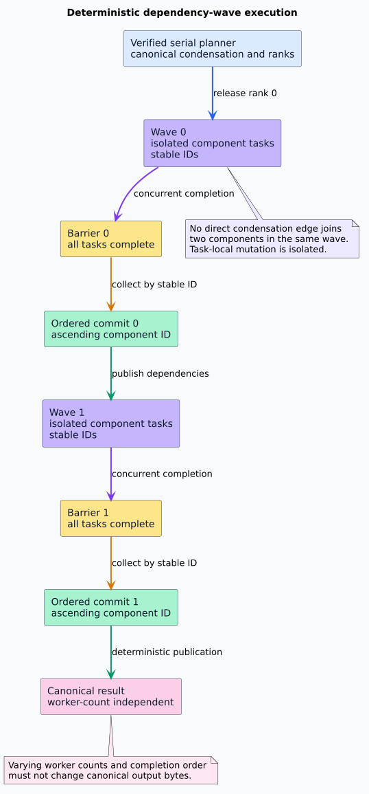

# Performance and Deterministic Concurrency

## Performance model

Let $`V`$ be canonical vertices, $`E`$ canonical source edges, $`N`$ supplied stable-vertex
items, $`I_E`$ supplied edge items, $`C`$ SCC components, $`R`$ cross-component candidates,
$`Q`$ distinct condensation edges, $`W`$ nonempty dependency waves, and $`B = 2{,}048`$ radix
buckets.

| Operation | Time | Auxiliary storage | Rationale |
|---|---:|---:|---|
| Arbitrary stable-label boundary | $`O(N\log N + I_E\log V + I_E + B)`$ | $`O(N + I_E + V)`$ | Contiguous binary heap for ordered unique nodes, binary search for endpoints, fixed-width edge radix |
| Dense-identity construction | $`O(V + I_E + B)`$ | $`O(I_E + V + B)`$ | Six fixed 11-bit radix passes, CSR assembly, optional transpose |
| CSR validation or transpose | $`O(V + E)`$ | $`O(V + E)`$ for a returned transpose | Every offset, target, and edge is inspected a constant number of times |
| Breadth- or depth-first traversal | $`O(V_r + E_r)`$ | $`O(V)`$ | $`V_r`$ and $`E_r`$ are reached vertices and scanned outgoing edges; discovery occurs before queue/stack insertion |
| SCC semantic trace | exactly $`5V + E`$ events | at most $`5V + C \le 6V`$ temporary logical entries | Iterative Tarjan with heap-owned frames, active stack, and raw-component sizes |
| Exact decomposition and quotient | linear word-RAM bound | at most $`5V + 4C + 2R + B`$ reusable slots | Flat fibers, fixed-width quotient radix, paired condensation CSR |
| Wavefront schedule | exactly $`6C + Q + 3W + 1`$ events | three transient vectors; two returned vectors | FIFO Kahn traversal, ranks, stable flat-wave placement |

The arbitrary-label boundary and dense analysis path are intentionally reported separately. A
comparison lower bound at the caller-facing identifier boundary is not evidence that dense CSR
analysis is superlinear.

## Allocation and locality choices

- Forward and reverse adjacency use contiguous CSR offsets and targets.
- Breadth-first traversal reuses its result vector as a cursor-indexed first-in, first-out queue.
- Depth-first traversal marks discovery before insertion, so no vertex can occupy multiple pending
  stack entries.
- `SccWorkspace` reuses the Tarjan arrays, explicit stacks, quotient candidates, radix scratch,
  and bucket counts.
- Condensation construction builds both CSR directions in paired passes.
- A wave schedule owns one offset vector and one member vector, not a vector per wave.

A headless heaptrack capture of a 100,000-component chain reports exactly five allocation calls
whose backtrace contains `Condensation::schedule_impl`. The count is independent of the 100,000
singleton waves: three allocations are transient schedule work/rank storage and two are retained
flat outputs. Use the headless command in the verification workflow to reproduce the observation.

## Parallel evaluation contract

libvgraph computes the canonical graph, SCC quotient, and schedule serially. The returned waves
expose safe deterministic parallelism to consumers. Same-wave components have no direct
condensation dependency, while every inter-wave dependency points from a lower rank to a higher
rank.



The consumer protocol is:

```text
procedure EVALUATE-WAVES(schedule, evaluate, commit)
    for each wave in ascending rank order
        launch one isolated task per component using component ID as stable task ID
        wait until every task in the wave has returned
        sort or place results by ascending component ID
        commit results in that canonical order
    return the committed canonical result
end procedure
```

The barrier preserves dependency readiness. Isolated task state prevents data races. Ordered
commit removes worker-count and completion-timing nondeterminism. A future parallel kernel path is
acceptable only if differential tests show byte-identical observations across worker counts,
randomized completion orders, cancellation boundaries, and repeated executions.

`CsrGraph<K>`, `SccDecomposition`, and `WavefrontSchedule` contain immutable owned buffers and
inherit Rust's `Send` and `Sync` auto-traits when their generic payload does. Share immutable
results with `Arc` when ownership requires it. `SccWorkspace` requires mutable access; allocate one
per worker rather than placing one behind a contended lock.

## Measurement discipline

The iterative Tarjan choice is inherited from libcpg's completed algorithm study. Do not repeat a
Tarjan-versus-Kosaraju bake-off. New experiments target only libvgraph-specific changes: dense CSR
construction, workspace reuse, flat-wave scheduling, consumer wave execution, and boundary-free
packaging.

Every heavy benchmark or profiler capture runs in a no-swap systemd scope with explicit memory and
CPU limits. Pre-register the graph family, size, build profile, sample count, and acceptance
threshold. Report throughput, peak resident memory, allocations, and cache behavior separately;
no single wall-clock sample establishes an optimization claim.
