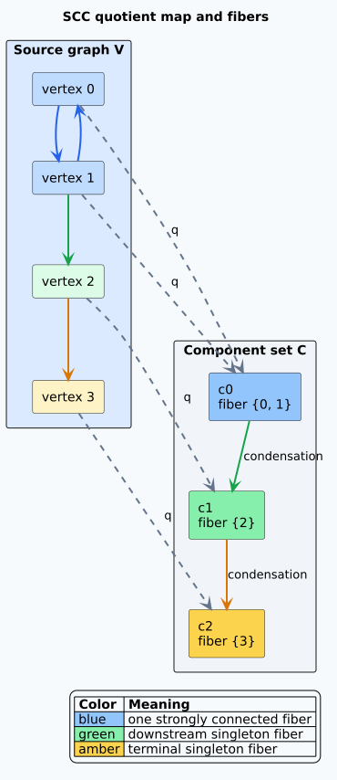
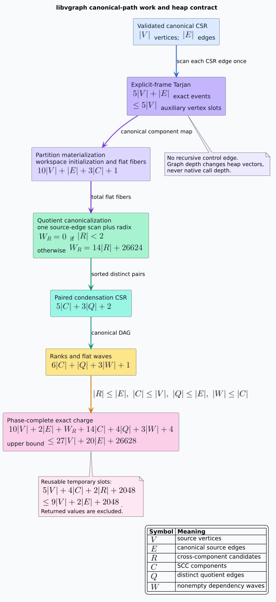

# Graph Quotients, Fibers, and Deterministic Condensation

## Terminology

A **directed graph** consists of a vertex set $`V`$ and an edge relation
$`E \subseteq V \times V`$. A **path** is a finite sequence of composable edges; the empty
path makes reachability reflexive. Vertices $`u`$ and $`v`$ are **strongly connected** when
$`u`$ reaches $`v`$ and $`v`$ reaches $`u`$.

A **strongly connected component** (SCC) is one equivalence class of mutual reachability. The
**quotient map** $`q : V \to C`$ sends each vertex to its SCC in the component set $`C`$. The
**fiber** above component $`c`$ is the inverse image
$`q^{-1}(c) = \{v \in V : q(v) = c\}`$. This use of “fiber” requires only a map and an
inverse image. It does not assert that $`q`$ is a categorical fibration.

The **condensation edge relation** contains $`c \to d`$ precisely when $`c \ne d`$ and the
source graph has an edge $`u \to v`$ with $`q(u) = c`$ and $`q(v) = d`$. The resulting
**condensation graph** has one vertex per SCC.



## Required laws

The production representation must refine the following laws.

1. **Totality.** Every source vertex belongs to the fiber above its image.
2. **Disjointness.** If one vertex belongs to fibers above $`c`$ and $`d`$, then $`c = d`$.
3. **Exact kernel.** $`q(u) = q(v)`$ exactly when $`u`$ and $`v`$ are mutually reachable.
4. **Edge preservation.** Every cross-component source edge induces exactly one condensation
   edge after duplicate removal, and every condensation edge has a source-edge witness.
5. **Acyclicity.** If component $`c`$ reaches $`d`$ and $`d`$ reaches $`c`$, then
   $`c = d`$. Thus no directed cycle contains distinct condensation components.
6. **Renaming equivariance.** A bijective vertex renaming that preserves the edge relation and
   commutes with the quotient induces the corresponding component renaming and no semantic
   change.
7. **Enumeration invariance.** Permuting or duplicating an input edge enumeration does not change
   its extensional edge relation after canonicalization.
8. **Wavefront validity.** A rank assigned along a topological traversal strictly increases on
   every condensation edge. Therefore two components at the same rank have no direct dependency.

The Rocq development packages exact kernel and surjectivity requirements as
`scc_quotient_laws`. It proves that any map satisfying that contract has nonempty fibers and an
antisymmetric condensation reachability relation. It also proves exact quotient-edge witnesses,
bidirectional edge preservation under invertible renaming data, extensional and duplicate
enumeration invariance, and wavefront independence. The exhaustive executable model constructs
the quotient and checks every directed graph with at most four vertices against an independent
transitive-closure oracle and all vertex renamings. The TLA+ model checks the explicit heap-frame
lifecycle, its frame bound, and exact operational work accounting.

## Complexity and native-stack contract

Let $`|V|`$ be the canonical vertex count, $`|E|`$ the canonical edge count, $`|R|`$ the number
of cross-component edge candidates before quotient deduplication, $`|C|`$ the strongly connected
component (SCC) count, $`|Q|`$ the distinct condensation-edge count, $`|W|`$ the number of
nonempty dependency waves, and $`B = 2{,}048`$ the radix bucket count. A complete explicit-frame
Tarjan semantic trace performs exactly:

```math
|V|_{\mathrm{roots}} + |V|_{\mathrm{discoveries}} + |E|_{\mathrm{edges}} +
|V|_{\mathrm{finishes}} + |V|_{\mathrm{active\ pops}} +
|V|_{\mathrm{canonical\ assignments}} = 5|V| + |E|.
```

This identity describes Tarjan’s semantic events, not all representation work. Phase-complete
charging additionally includes safe vector initialization and flat, sorted fiber materialization.
The cost model charges one unit for each explicit loop iteration and each element initialized by an
input-dependent bulk operation. Capacity reservation without element initialization is governed by
memory limits and is not charged as loop work.

The discovery, low-link, and raw-component arrays each contain $`|V|`$ slots. The active stack
and explicit frame stack each peak at no more than $`|V|`$ entries. Excluding returned output,
the Tarjan-only auxiliary bound is therefore $`5|V|`$ vertex-sized slots. The implementation has
no recursive control edge; graph depth changes heap-vector lengths, not native call depth.

The nonrecursive least-significant-digit radix canonicalizer uses six 11-bit passes over 64-bit
component pairs. Before a full sort, its deterministic charge includes safe initialization of
$`|R|`$ scratch elements and $`B`$ bucket elements. Each pass scans candidates twice and buckets
twice: once to clear counts and once to form prefixes. Deduplication adds one candidate scan. The
fewer-than-two-candidates fast path performs none of this work, so the exact charged cost is:

```math
W_{\mathrm{radix}}(|R|) =
\begin{cases}
0, & |R| < 2, \\
(|R| + B) + 6(2|R| + 2B) + |R|
  = 14|R| + 13B, & |R| \ge 2.
\end{cases}
```

The remaining phase charges are explicit:

| Phase | Exact charged work | Included operations |
|---|---:|---|
| SCC partition | $`10\lvert V\rvert + \lvert E\rvert + 3\lvert C\rvert + 1`$ | Workspace initialization, Tarjan trace, canonical map, flat sorted fibers |
| Quotient source scan | $`\lvert E\rvert`$ | Cycle flags and cross-component candidates |
| Condensation CSR | $`5\lvert C\rvert + 3\lvert Q\rvert + 2`$ | Paired forward/reverse offsets, prefixes, targets, reverse fill, offset restoration |
| Wavefront schedule | $`6\lvert C\rvert + \lvert Q\rvert + 3\lvert W\rvert + 1`$ | Indegrees, ranks, removals, quotient-edge scan, flat offset counting and prefixing, member initialization and stable placement, offset restoration |

Consequently, the phase-complete exact charge is:

```math
10|V| + 2|E| + W_{\mathrm{radix}}(|R|) + 14|C| + 4|Q| + 3|W| + 4.
```

Because $`|R| \le |E|`$, $`|C| \le |V|`$, $`|Q| \le |E|`$,
$`|W| \le |C|`$, and $`13B = 26{,}624`$, the uniform upper bound is:

```math
10|V| + 2|E| + W_{\mathrm{radix}}(|R|) + 14|C| + 4|Q| + 3|W| + 4
\le 27|V| + 20|E| + 26{,}628.
```

Reusable temporary storage retains five Tarjan vertex arrays or stacks, four component-sized
arrays or queues, the candidate and radix scratch vectors, and the fixed bucket array. Flat wave
offsets and members belong to the returned schedule, so they are not auxiliary workspace.
Returned partition and condensation values are likewise excluded. The workspace bound is:

```math
5|V| + 4|C| + 2|R| + B \le 9|V| + 2|E| + 2{,}048.
```



These are charged logical loop and bulk-initialization bounds, not instruction counts or wall-clock
predictions. The formulas expose workspace preparation, returned-representation construction,
both fixed bucket scans, and flat-wave construction instead of hiding them in asymptotic notation.
Production acceptance also measures cache misses, allocations, peak resident memory, and
throughput on relevant Vinary workloads. It reuses libcpg's established choice of iterative
Tarjan rather than repeating an already-settled Tarjan-versus-Kosaraju comparison.

## Representation refinement

The mathematical graph is a relation, not an iteration order. The future Rust kernel may use
dense integer identifiers and CSR arrays, provided its validator establishes:

- stable vertices are strictly ordered and unique;
- offsets start at zero, are monotone, and end at the target count;
- every target is in range;
- each adjacency slice is strictly ordered and unique;
- forward and reverse CSR contain exactly inverse edge pairs;
- optional edge payloads align one-to-one with forward targets; and
- malformed public or deserialized values fail before indexed traversal.

Canonical component identifiers are a representation choice. `libcpg` currently orders SCCs by
their least stable node identifier. A bijective vertex renaming can therefore change numeric SCC
identifiers while preserving the partition up to the induced component bijection. Tests must
compare the commuting square, not demand accidental numeric-ID equality.

## Literate algorithm

The pre-implementation model follows this pseudocode. Canonicalization is deliberately first:
all later algorithms consume one extensional graph rather than caller-controlled enumeration
order.

```text
procedure CANONICAL-CONDENSATION(vertex_count, input_edges)
    reject every edge whose endpoint is outside the declared vertex domain
    sort and deduplicate each forward adjacency slice
    construct reverse adjacency by reversing every retained edge
    flatten both directions into validated CSR offsets and targets

    raw_component_of := ITERATIVE-TARJAN(forward_CSR, heap_owned_frames)
    components, component_of := ASCENDING-DENSE-CANONICAL-SCAN(raw_component_of)

    quotient_candidates := empty fixed-width pair vector
    for each source edge (u, v)
        if component_of[u] differs from component_of[v]
            append (component_of[u], component_of[v]) to quotient_candidates
    quotient_edges := FIXED-WIDTH-RADIX-SORT-AND-DEDUPLICATE(quotient_candidates)

    ranks := deterministic linear longest-predecessor ranks over quotient_edges
    wave_offsets, wave_members := FLATTEN-WAVES(ranks)
    return components, component_of, quotient_edges, ranks, wave_offsets, wave_members
end procedure

procedure FLATTEN-WAVES(ranks)
    wave_count := zero for no components, otherwise one plus the maximum rank
    offsets := wave_count plus one zeroes
    for each component in ascending order
        increment offsets[ranks[component] + 1]
    prefix-sum offsets from left to right

    members := component_count uninitialized slots
    for each component in descending order
        decrement offsets[ranks[component] + 1]
        members[offsets[ranks[component] + 1]] := component

    shift the recovered wave starts one position left
    set offsets[wave_count] to component_count
    return offsets, members
end procedure
```

Descending placement makes each wave slice ascending without a comparison sort. The returned
representation always has two vectors regardless of the number of waves, eliminating the
$`O(|W|)`$ independent allocations required by a vector of vectors. Adjacent offsets delimit every
wave, the terminal offset equals $`|C|`$, and the member vector is a permutation of the dense
component domain. The returned representation has exactly $`|C| + |W| + 1`$ element slots across
those two vectors. The Rocq refinement theorems connect those representation laws to wavefront
independence and prove both output-resource identities; the exhaustive model constructs the arrays,
accumulates work from the executed loops, and checks them for every bounded graph and vertex
renaming.

The formal model rejects a malformed CSR direction unless its offsets have the required shape,
begin at zero, are monotone, end at the target count, and delimit strictly sorted unique in-range
targets. It additionally requires forward and reverse directions to denote exact inverse edge
relations.

## Worked example

Let the source edges be `0 → 1`, `1 → 0`, `1 → 2`, and `2 → 3`. The quotient has fibers
`{0, 1}`, `{2}`, and `{3}`. Its condensation contains two edges:
`{0, 1} → {2}` and `{2} → {3}`. Duplicate source edges or a reversed input enumeration do not
change this result.

A counterexample clarifies why arbitrary projection is insufficient. If a mapping combines
vertices `1` and `2` without proving mutual reachability, the projected graph may erase the
dependency between their components and may introduce a false cycle. Such a mapping is not an SCC
quotient and cannot carry the acyclicity evidence.

## Algorithmic reference

The implementation baseline is the workspace's established Tarjan depth-first SCC lineage,
represented iteratively with explicit heap frames. libcpg supplies the primary production
behavior, while PraTTaIL supplies an independently exhaustive four-vertex oracle and a 256-KiB
small-stack gate. The campaign does not repeat the already-completed algorithm bake-off. See
Robert E. Tarjan,
“Depth-First Search and Linear Graph Algorithms,” *SIAM Journal on Computing* 1(2), 1972,
[https://doi.org/10.1137/0201010](https://doi.org/10.1137/0201010).
