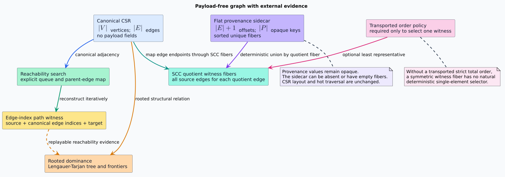
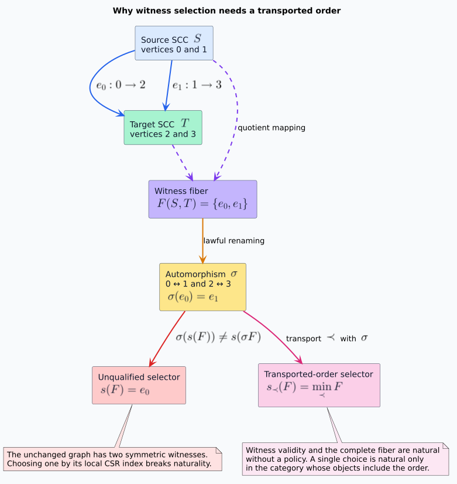
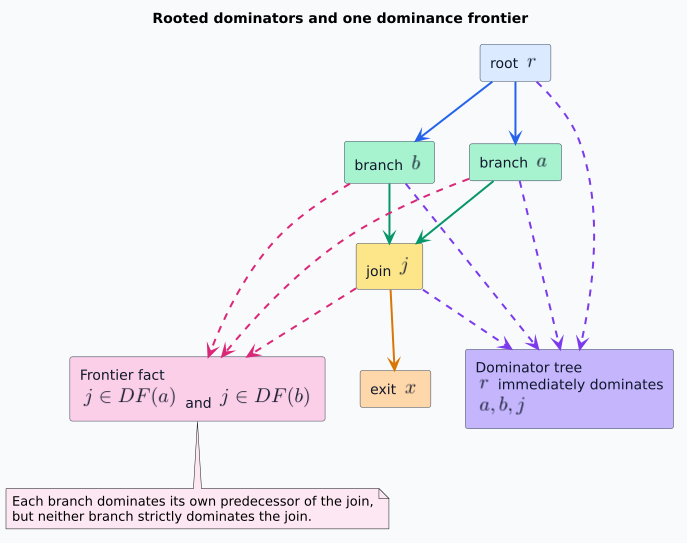

# Graph Witnesses, Provenance Fibers, and Dominance

## Purpose and scope

This document defines the mathematical contract for evidence derived from a `libvgraph` graph.
The evidence is external to the compressed sparse row (CSR) graph: no provenance value, path
payload, dominator fact, or source-domain identifier is inserted into the structural graph.

The symbols used below are:

- $`V`$ is the finite set of vertices;
- $`E \subseteq V \times V`$ is the canonical directed-edge relation;
- $`I_E = \{0, \ldots, |E|-1\}`$ is the set of canonical CSR edge indices;
- $`P`$ is an opaque provenance-key set;
- $`C`$ is the set of strongly connected components (SCCs); and
- $`q : V \to C`$ is the total SCC quotient map.

A **witness** is replayable structural evidence for a true graph statement. A witness is not a
proof of source-domain meaning. A **fiber** over a key is the collection of values which project
to that key. The term is used concretely: the provenance sidecar has a fiber over each edge index,
and the condensation witness relation has a fiber over each quotient edge.



## Provenance as an indexed family

A logical provenance sidecar is the indexed family

```math
S : I_E \longrightarrow \mathcal{P}_{\mathrm{fin}}(P),
```

where $`\mathcal{P}_{\mathrm{fin}}(P)`$ denotes finite subsets of opaque keys. Empty fibers are
valid, so a graph can be analyzed without provenance. A flat representation uses $`|E|+1`$
monotone offsets and one sorted, duplicate-free member array.

Union is pointwise:

```math
(S_1 \cup S_2)(i) = S_1(i) \cup S_2(i).
```

The Rocq contract proves associativity, commutativity, idempotence, preservation of the edge-index
bound, and duplicate freedom after canonicalization. The empty sidecar is the identity. Thus
sidecars form a join-semilattice under extensional equality; this does not turn provenance keys
into weights, costs, or semiring values.

### Deterministic flat union

Each input fiber is sorted and duplicate-free. The implementation refinement therefore uses a
two-cursor merge rather than concatenation followed by comparison sorting.

```text
MERGE-FIBER(left, right)
  reserve at most length(left) + length(right) output slots
  while either cursor has a value
    emit the smaller value
    if both values are equal, emit once and advance both cursors
  return the sorted duplicate-free output fiber
```

Across the complete sidecar, the logical charge is

```math
W_{\cup}
  = 2|E| + |P_1| + |P_2| + |P_{\mathrm{out}}| + 1
  \leq 2|E| + 2|P_1| + 2|P_2| + 1.
```

Returned members are output. Merge cursors and counters are constant auxiliary state; the new
offset array is returned storage.

## Edge-index path witnesses

A path witness contains a source vertex, a sequence of canonical edge indices, and an expected
target vertex. Replay maintains one current vertex. For each edge index, it verifies that the
indexed edge starts at the current vertex and then moves to that edge's target. An empty sequence
is valid exactly when source and target are equal.

```text
REPLAY(graph, source, edge_indices, expected_target)
  current := source
  for edge_index in edge_indices
    reject if edge_index is outside the canonical edge domain
    (edge_source, edge_target) := graph.edge_at(edge_index)
    reject if edge_source differs from current
    current := edge_target
  accept exactly when current equals expected_target
```

Rocq proves that replay implies relational reachability, that every relational reachability proof
has an edge-index replay when edge indexing is complete, that concatenated replays compose, and
that replay transports along lawful vertex and edge-index renamings. Replay performs exactly
$`|\pi|`$ edge steps for path $`\pi`$ and retains two logical scalar slots, independent of path
length.

### Reachability search

The reference search is breadth-first search (BFS) over canonical adjacency. It uses an explicit
heap queue, a discovered bitmap, and one parent edge per discovered non-root vertex. Canonical
edge order gives deterministic output for one graph representation, and BFS gives a shortest-hop
witness.

For $`R_V`$ reached vertices, $`R_E`$ scanned outgoing edges, and returned path length $`L`$:

```math
W_{\mathrm{BFS}} = |V| + 2|R_V| + |R_E| + L + 1
  \leq 4|V| + |E| + 1.
```

The bound uses $`|R_V| \leq |V|`$, $`|R_E| \leq |E|`$, and a simple shortest path with
$`L \leq |V|`$. The parent map and queue are heap-resident. No graph-depth state is placed on the
native call stack.

## Condensation witness fibers

For distinct components $`c,d \in C`$, the complete source-edge witness fiber is

```math
F(c,d) =
\{i \in I_E :
  \exists (u,v)=\mathrm{edgeAt}(i),
  q(u)=c \land q(v)=d\}.
```

The fiber is nonempty exactly when the condensation contains edge $`(c,d)`$. Every member replays
to a concrete source edge, every cross-component source edge belongs to exactly one quotient-edge
fiber, and the complete fiber transports under lawful renaming. This complete-fiber observation
is insertion-order invariant and equivariant under arbitrary vertex bijections.

If provenance is propagated to a quotient edge, the quotient fiber's provenance is the
deterministic union of the sidecar fibers of every edge in $`F(c,d)`$. A fixed-width provenance
key can be canonicalized with a stable radix pipeline in linear word-RAM work. An arbitrary
comparison key has its comparison-model sorting cost named separately.

## Why a single representative needs a policy

A deterministic selector from every nonempty witness fiber cannot be natural under all graph
automorphisms. Consider two SCCs with cross edges $`e_0 : 0 \to 2`$ and
$`e_1 : 1 \to 3`$. An automorphism swaps $`0`$ with $`1`$ and $`2`$ with $`3`$, so it swaps
$`e_0`$ with $`e_1`$ while preserving the graph and quotient edge. A selector fixed on the
unchanged graph cannot also map its choice through that swap.



The Rocq theorem `unqualified_equivariant_selector_impossible` checks the two-element core of this
argument. This is an instance of the naturality discipline described by Mac Lane: a construction
must commute with the relevant morphisms, not merely return a deterministic local answer
([Mac Lane 1998](https://doi.org/10.1007/978-1-4757-4721-8)).

The contract therefore separates two APIs:

1. Complete witness fibers are natural without a selection policy.
2. A single representative is the least fiber member under an explicit strict total order.

For the second API, a lawful renaming transports both the fiber and the order. Rocq proves that
least witnesses are unique and that least-witness selection commutes with such a transported
order. Selecting the least local CSR index is only claimed equivariant for renamings that preserve
that index order.

The same qualification applies to choosing one among several shortest paths. Path validity,
reachability, and shortest distance are unconditionally equivariant. Exact selected path bytes
are equivariant only when the tie-break policy is included in the transported input.

## Rooted dominance

Fix a root $`r \in V`$. A vertex $`d`$ **dominates** a reachable vertex $`v`$ when every path
from $`r`$ to $`v`$ visits $`d`$. A vertex strictly dominates another when it dominates it and the
two vertices differ. The **immediate dominator** of a reachable non-root vertex $`v`$ is the
unique strict dominator of $`v`$ dominated by every other strict dominator of $`v`$.

Unreachable vertices have no dominator entry. The root and an unreachable vertex must therefore
remain distinguishable in a later typed API; a bare optional parent is not a sufficient semantic
result by itself.

Rocq proves:

- the root dominates every reachable vertex;
- every reachable vertex dominates itself;
- immediate dominators are unique under the dominance antisymmetry law; and
- dominance-frontier membership carries an explicit predecessor-edge witness.

The executable model computes immediate dominators with the iterative Lengauer–Tarjan algorithm.
The original analysis gives $`O(|E|\alpha(|E|,|V|))`$ work for the sophisticated link-eval
variant, where $`\alpha`$ is an inverse Ackermann function
([Lengauer and Tarjan 1979](https://doi.org/10.1145/357062.357071)). The union-find basis is
Tarjan's path-compression analysis
([Tarjan 1975](https://doi.org/10.1145/321879.321884)).

All depth-first search and link-eval compression paths are explicit heap vectors. The formal
charge separates link-eval work $`A`$:

```math
W_{\mathrm{dom}} = 8|V| + 2|E| + A + 1.
```

If $`A \leq k(|V|+|E|)`$ for the applicable inverse-Ackermann factor $`k`$, Rocq proves

```math
W_{\mathrm{dom}}
  \leq (8+k)|V| + (2+k)|E| + 1.
```

This near-linear bound is the production target. The slower iterative set-intersection algorithm
is retained only as an independent small-graph oracle, never as the planned hot path.

## Dominance frontiers

The dominance frontier of owner $`x`$ is

```math
DF(x) =
\{y \in V :
  \exists p, (p,y) \in E
  \land x\ \mathrm{dominates}\ p
  \land x\ \mathrm{does\ not\ strictly\ dominate}\ y\}.
```

This definition permits $`x \in DF(x)`$ for loops. Removing self-membership is therefore an
invalid mutant, not a simplification.



The output-sensitive dominator-tree algorithm uses the local and upward rules from the dominance
frontier construction introduced by Cytron et al.
([Cytron et al. 1991](https://doi.org/10.1145/115372.115320)). For candidate count $`K \leq |E|`$
and returned frontier entries $`F`$, the contract charges

```math
W_{DF} = 4|V| + 2|E| + K + F + 1
  \leq 4|V| + 3|E| + F + 1.
```

The $`F`$ term is unavoidable because those entries are returned. Temporary traversal state is
linear in the rooted graph and remains heap-resident.

## Outcome separation

Every operation distinguishes:

- exact evidence;
- unreachable;
- invalid edge or malformed sidecar;
- resource limit exceeded; and
- cancelled.

Rocq proves that no incomplete constructor equals an exact constructor. TLA+ checks that the
bounded lifecycle never promotes cancellation, invalid state, exhaustion, or unreachable search
to exact completion.

## Claim boundary

The following claims are intentionally different.

| Observation | Insertion-order invariant | Arbitrary-renaming equivariant | Requires transported order |
|---|---:|---:|---:|
| Provenance fiber membership | yes | yes | no |
| Pointwise provenance union | yes | yes | no |
| Path replay validity | yes | yes | no |
| Reachability and shortest distance | yes | yes | no |
| Exact selected shortest path | yes | only with policy | yes |
| Complete quotient-edge witness fiber | yes | yes | no |
| One quotient-edge representative | yes | only with policy | yes |
| Dominance relation and frontier sets | yes | yes | no |

No theorem calls these families a fibration. Such a claim would require a separately specified
lifting operation and executable lifting laws.
