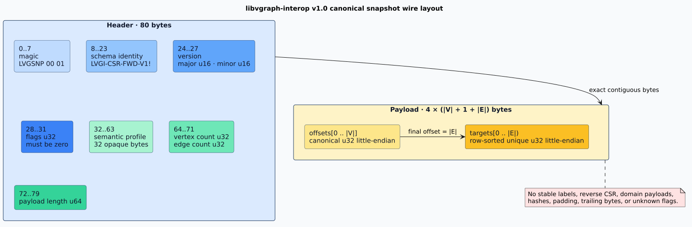

# Canonical snapshot wire format

This is the normative version 1.0 wire grammar for `libvgraph-interop`. All offsets in
this document are zero-based byte offsets. Every multibyte integer is unsigned and little-endian.

## Constants

| Name | Type | Version 1.0 value |
|---|---:|---|
| Magic | 8 bytes | Hex `4c 56 47 53 4e 50 00 01` |
| Schema identity | 16 bytes | ASCII `LVGI-CSR-FWD-V1!` |
| Version | two `u16` values | Major 1, minor 0 |
| Header size | bytes | 80 |
| Word size | bytes | 4 |
| Digest size | bytes | 32 |
| Digest context | UTF-8 | `libvgraph-interop 2026-09-02 17:22:31 UTC canonical snapshot digest v1` |

## Header

| Byte range | Width | Field | Admission rule |
|---|---:|---|---|
| 0..8 | 8 | Magic | Must equal the v1 magic |
| 8..24 | 16 | Schema identity | Must equal `LVGI-CSR-FWD-V1!` |
| 24..26 | 2 | Major version | Must equal 1 |
| 26..28 | 2 | Minor version | Must equal 0 |
| 28..32 | 4 | Flags | Must equal 0; every unknown bit rejects |
| 32..64 | 32 | Semantic profile identity | Must equal the caller's expected profile |
| 64..68 | 4 | Vertex count `V` | Must not exceed the configured vertex limit |
| 68..72 | 4 | Edge count `E` | Must not exceed the configured edge limit |
| 72..80 | 8 | Payload byte count | Must equal the checked formula below |



The exact payload and total lengths are:

```math
\begin{aligned}
L_{\mathrm{payload}} &= 4(V + 1 + E),\\
L_{\mathrm{snapshot}} &= 80 + L_{\mathrm{payload}}.
\end{aligned}
```

Both expressions are evaluated with checked arithmetic before conversion to `usize` or
allocation. Counts are wire-level `u32` values, while configured limits may be lower.

## Payload

The payload contains exactly these arrays with no alignment padding:

1. `V + 1` forward offsets as little-endian `u32` values.
2. `E` forward targets as little-endian `u32` values.

The representation is canonical precisely when:

- `offsets.len() == V + 1`;
- `offsets[0] == 0`;
- offsets are nondecreasing;
- `offsets[V] == E`;
- every target is less than `V`; and
- each half-open target row `targets[offsets[s]..offsets[s + 1]]` is strictly
  increasing.

Strict target order simultaneously establishes row sorting and duplicate rejection. Empty graphs
still encode one zero offset, so their total length is 84 bytes.

## Encoder pseudocode

The pseudocode is literate: each statement corresponds to one admission or layout obligation.

```text
ENCODE(graph, profile):
    require graph.validate() succeeds
    V ← checked_u32(graph.vertex_count)
    E ← checked_u32(graph.edge_count)
    payload_length ← checked_u64(4 × (V + 1 + E))
    total_length ← checked_usize(80 + payload_length)
    output ← byte vector with capacity total_length
    append exact magic, schema, version, zero flags, and profile
    append V, E, and payload_length in little-endian form
    for offset in graph.forward_offsets:
        append little_endian_u32(offset)
    for target in graph.forward_targets:
        append little_endian_u32(target.raw)
    require output.length = total_length
    return output
```

There is no input-depth recursion and no per-word allocation.

## Decoder pseudocode and error precedence

Error precedence is stable so equivalent malformed inputs receive deterministic diagnostics.

```text
DECODE(bytes, expected_profile, limits):
    reject if fewer than 80 bytes
    reject mismatched magic
    reject mismatched schema
    reject any version other than 1.0
    reject nonzero flags
    reject mismatched semantic profile
    parse V, E, and declared payload length
    reject V, E, or total bytes above caller limits
    reject arithmetic or address-space overflow
    reject a declared payload length not equal to 4 × (V + 1 + E)
    reject truncated or trailing bytes
    allocate exactly V + 1 offsets and E targets
    parse each u32 with a monotonically increasing cursor
    validate offset origin, order, and terminal
    validate target range and strict order within every row
    publish the canonical forward graph
```

An implementation must return typed errors for the named classes. It may attach byte positions and
observed values without changing precedence.

## Verified decode

`decode_verified_snapshot` first enforces configured byte limits, then computes the
expected digest over the exact supplied slice and compares all 32 bytes. It publishes only after
digest and structural admission both pass. Hashing a contiguous slice in an optimized BLAKE3 pass,
followed by one structural parsing pass, is deliberate: updating a hasher once per four-byte word
would inhibit the primitive's vectorized bulk path and add a call per word.

The digest call is semantically:

```text
hasher ← BLAKE3_DERIVE_KEY(DIGEST_CONTEXT)
hasher.update(SCHEMA_ID)
hasher.update(expected_profile)
hasher.update(little_endian_u64(snapshot_bytes.length))
hasher.update(snapshot_bytes)
digest ← hasher.finalize_32()
```

The schema and profile also occur in the snapshot header. Their deliberate repetition binds the
digest invocation to the caller's expected identities before the snapshot is interpreted.

## Golden vector: empty graph

Profile: 32 zero bytes. Graph: no vertices and no edges.

```text
4c5647534e5000014c5647492d4353522d4657442d5631210100000000000000
0000000000000000000000000000000000000000000000000000000000000000
0000000000000000040000000000000000000000
```

Removing line breaks yields the normative 84-byte vector.

## Golden vector: one edge

Profile bytes are `00, 01, ..., 1f`. The graph has vertices 0 and 1 and edge
`0 -> 1`.

```text
4c5647534e5000014c5647492d4353522d4657442d5631210100000000000000
000102030405060708090a0b0c0d0e0f101112131415161718191a1b1c1d1e1f
0200000001000000100000000000000000000000010000000100000001000000
```

Removing line breaks yields the normative 96-byte vector. The payload is offsets
`[0, 1, 1]` followed by target `[1]`.

## Compatibility and migration

The v1.0 reader accepts only v1.0. A new schema must:

1. receive a distinct 16-byte schema identity;
2. define an exact version and flag policy;
3. ship its own golden vectors and malformed corpus;
4. provide an explicit old-to-new migration through validated graph values; and
5. retain the old decoder for every advertised compatibility window.

Changing field width, order, meaning, canonicality, digest context, or digest material is a schema
change. A Rust API version change alone does not alter persisted bytes.
